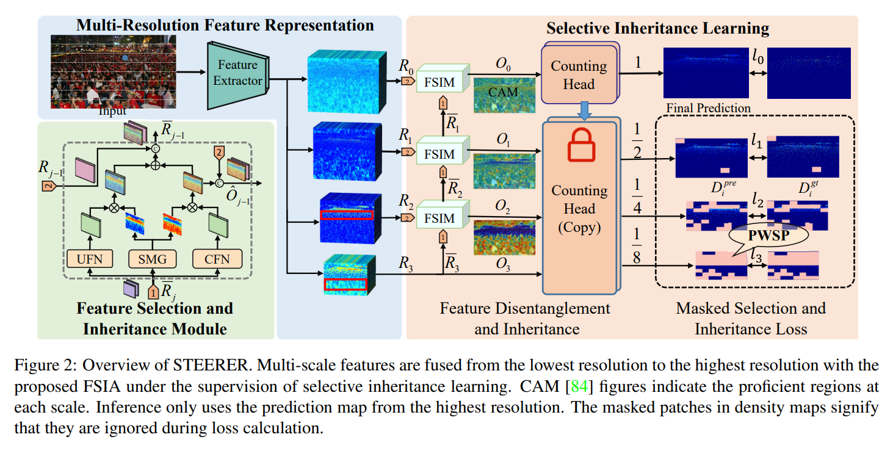

# STEERER for Object Counting and Localizaiotion (ICCV 2023)
## Introduction
This is the official PyTorch implementation of paper: [**STEERER: Resolving Scale Variations for Counting and Localization via Selective Inheritance Learning**](https://arxiv.org/abs/2308.10468), which effectively addressed the issue of scale variations for object counting and localizaioion, demonstrating the state-of-arts counting and localizaiton performance for different catagories, such as crowd,vehicle, crops and trees . 

# Catalog
- [x] Training and Testing Code (18/08/2023)
- [x] Pretrained models for SHHB, JHU, TRANSCOS, MTC, TREE (30/10/2023)
- [x] Pretrained models for NWPU, QNRF (coming soon)


# Getting started 

## preparation 

- **Clone this repo** in the directory (```root/```):


```bash
cd $root
git clone https://github.com/taohan10200/STEERER.git
```
- **Install dependencies.** We use python 3.9 and pytorch >= 1.12.0 : http://pytorch.org.

```bash
conda create -n STEERER python=3.9 -y
conda activate STEERER
conda install pytorch==1.12.0 torchvision==0.13.0 cudatoolkit=11.3 -c pytorch
cd ${STEERER}
pip install -r requirements.txt
```

- **Prepare datasets and weights.** Pretrained models are available at the [OneDrive](https://pjlab-my.sharepoint.cn/:f:/g/personal/hantao_dispatch_pjlab_org_cn/EpdTPZDeIhxCpR5gr46iXyYBZXgpMxNTBk0rqqQc6po3UQ?e=ewxq7i) net disk,  and you can selectively dolownd the dataset that you want to train or inference. Before starting your training and testing, you should organiza your project as the following directory tree. 

````bash

  $root/
  ├── ProcessedData
  │   ├── SHHB
  │   │   ├── images     # the input images
  │   │   ├── jsons      # the annotated labels
  │   │   ├── train.txt   # the image name of train set 
  │   │   ├── test.txt    # the image name of test set
  │   │   ├── test_gt_loc.txt  # the localization labels for evaluation
  │   │   └──train_gt_loc.txt  # the localization labels for train set (not used)
  │   ├── SHHA
  │   ├── NWPU
  │   ├── QNRF
  │   ├── JHU
  │   ├── MTC
  │   ├── JHU
  │   ├── JHUTRANCOS_v3
  │   └── TREE
  ├── PretrainedModels
  └── STEERER

````

## Training
we provide simplify script to run distributed or cluster training,
```bash
# $1 is the configuration file, $2 is the GPU_ID, also support multiple GPUs, like 1,2,3,4 
sh train.sh configs/SHHB_final.py 1  

```
or if you are trainging on the computer cluster, you could be run

```bash
# $3 the configuration file, $4 is the number of GPUs
sh slurm_train.sh partition_name job_name configs/SHHB_final.py 1
```
 

## Testing
To reproduce the performance, run the similry command like training,

```bash
# $1 is the configuration file, $2 is the checkpoint path, $3 is the GPU_ID, only support single GPU. 
sh test.sh configs/SHHB_final.py ../PretrainedModels/SHHB.pth 1

```
or if you are trainging on the computer cluster, you could be run

```bash
# $3 the configuration file,  $4 is the checkpoint path, $5 is the number of GPUs
sh slurm_test.sh partition_name job_name configs/SHHB_final.py ../PretrainedModels/SHHB.pth 1
```
 

## Reproduce Counting and Localization Performance

|            | Dataset     |  MAE/MSE |   F1-m./Pre./Rec. (%) | Pretraied Model | Dataset |
|------------|-------- |-------|-------|-------|------|
| This Repo      |  SHHB   | 5.8/8.5 |87.0/89.4/84.82.01 | [weights](https://pjlab-my.sharepoint.cn/:u:/g/personal/hantao_dispatch_pjlab_org_cn/ET5_eR8n2e5Akm19QvajQJcBTbryGy545hImwr2yzeKMSw?e=J9mwUY)| [Dataset](https://pjlab-my.sharepoint.cn/:u:/g/personal/hantao_dispatch_pjlab_org_cn/Ebo6dbV4hnlCtzFo3S5KW-ABwlCLLYWYADLOyYMGWJ6Qrw?e=L0Y0Wi)|
| This Repo      |  TRANSCOS   | 1.8/3.1 |95.1/91.7/93.4/ | [weights](https://pjlab-my.sharepoint.cn/:u:/g/personal/hantao_dispatch_pjlab_org_cn/EXxeKimCxW1CsP5HjNRlJF8BdfASUGxbBW1q40Ijp_j32A?e=K7cDeZ/ETfh8zPYbBREg-mJwMEtqTIB6sucZB4g1xJpVu-UN9dLZw?e=IfRT2w)|
| This Repo      |  MTC   | 2.74/3.72 |-| [weights](https://pjlab-my.sharepoint.cn/:u:/g/personal/hantao_dispatch_pjlab_org_cn/EXolIStQNy9CuxoWo6L6924BpfboWJL1djEfsfENFMohIw?e=7m7fka)| [Dataset](https://pjlab-my.sharepoint.cn/:u:/g/personal/hantao_dispatch_pjlab_org_cn/EWIjz_QnX8xAnDKEYS8vgRQBK9MDySll8gmEXxNhxkq2iA?e=jquZdN)|
| This Repo      |  JHU   | 54.5/240.6 |65.6/66.7/64.6| [weights](https://pjlab-my.sharepoint.cn/:u:/g/personal/hantao_dispatch_pjlab_org_cn/EYjeF4H3Xw9GlYvtYOhygCEBS7N39Si_izSr9jRH2Pslfg?e=KgIgbe)| [Dataset](https://pjlab-my.sharepoint.cn/:u:/g/personal/hantao_dispatch_pjlab_org_cn/EdWljIs3VGtDv_SJsEbfArUBOYE4asGAu9dtm6aWGX_PLw?e=qOccQV)|
| This Repo      |  TREE   | 8.2/11.3 |72.9/70.4/75.7| [weights](https://pjlab-my.sharepoint.cn/:u:/g/personal/hantao_dispatch_pjlab_org_cn/ES8QWb_bYZlGgXODD7whQkABueii634dPYvvVtNE9jPlog?e=35331P)| [Dataset](https://pjlab-my.sharepoint.cn/:u:/g/personal/hantao_dispatch_pjlab_org_cn/EaciE23qN29LjZPOMkpsm3wB0L_xZaqj-s2Ig2_DMnGFAw?e=fh1IKf)|
| This Repo      |  FDST   | 0.93/1.29 |97.4/98.0/96.7| [weights](https://pjlab-my.sharepoint.cn/:u:/g/personal/hantao_dispatch_pjlab_org_cn/ERU3N-R2bYVPqjWIOpxorcYBTTDPHzkTnj9owFLgQgvURQ?e=SHMpQJ)| [Dataset](https://pjlab-my.sharepoint.cn/:u:/g/personal/hantao_dispatch_pjlab_org_cn/EWtkM9DQMKRKhgQBNkxHy64B7AgRsyv8DhnFZRnlrF29Vw?e=Q0VPjG)|
| This Repo      |  UCF-QNRF   | 77.8/138.0 |75.6/79.7/72.0| [weights](https://pjlab-my.sharepoint.cn/:u:/g/personal/hantao_dispatch_pjlab_org_cn/EfE8YRRrAYVBj7HbkC78yPYBPjLURl1ltKlihKhTI1Kl4g?e=yvrPDb)| [Dataset](https://pjlab-my.sharepoint.cn/:u:/g/personal/hantao_dispatch_pjlab_org_cn/Ef9E9oVtjyBEld_RYpPtqFUBfTBSy6ZgT0rqUhOMgC-X9A?e=WNn9aM)|

<!-- # References
1. Acquisition of Localization Confidence for Accurate Object Detection, ECCV, 2018.
2. Very Deep Convolutional Networks for Large-scale Image Recognition, arXiv, 2014.
3. Feature Pyramid Networks for Object Detection, CVPR, 2017.  -->

# Citation
If you find this project is useful for your research, please cite:

```
@article{haniccvsteerer,
  title={STEERER: Resolving Scale Variations for Counting and Localization via Selective Inheritance Learning},
  author={Han, Tao, Bai Lei, Liu Lingbo, and Ouyang  Wanli},
  booktitle={ICCV},
  year={2023}
}
```

# Acknowledgement
The released PyTorch training script borrows some codes from the [HRNet](https://github.com/HRNet/HRNet-Semantic-Segmentation) and [MMCV](https://github.com/open-mmlab/mmcv) repositories. If you think this repo is helpful for your research, please consider cite them. 
